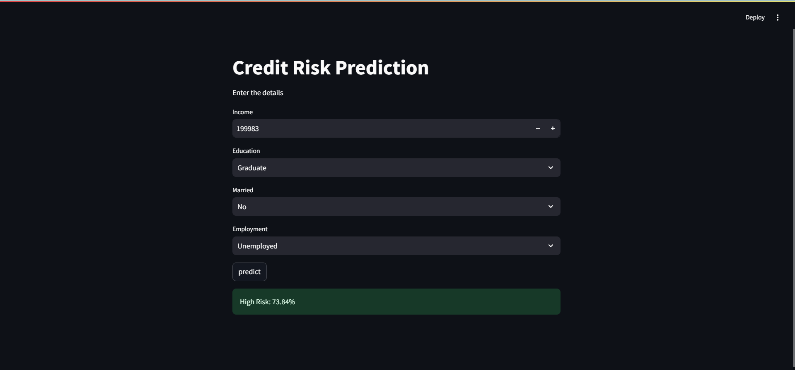

# credit-risk-prediction

# 💳 Credit Risk Prediction Web App

This is a **Streamlit-based web application** that predicts the **credit risk level** (Low, Medium, High) of a customer based on user-input features like income, education, employment status, and marital status. The model is trained using a logistic regression classifier on a dataset of 500,000 records.

## 📌 Features

- Accepts user inputs such as:
  - Income
  - Education Level
  - Marital Status
  - Employment Status
- Encodes and processes inputs automatically
- Uses a trained ML model to predict the risk score
- Displays output as:
  - 🟢 Low Risk
  - 🟡 Medium Risk
  - 🔴 High Risk

## 📊 Dataset

- Dataset used: `credit_risk_500k.csv`
- Includes features like:
  - Age
  - Income
  - Loan Amount
  - Credit History
  - Education, Marital, Employment Status

## ⚙️ Tech Stack

- Python 🐍
- Pandas & NumPy
- Matplotlib & Seaborn (for EDA)
- Scikit-learn (ML modeling)
- Streamlit (for web app)
- Joblib (for model serialization)

